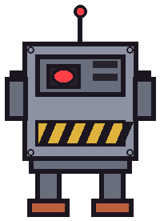

# star-visitor — Project Diary

*Phase-by-phase log. Entries append, never rewrite. Nothing is done until its wall is green twice.*

---
## 2026-09-22 13:19 — Slice A — the run-and-gun core

Controller with grounded/airborne aim states, the infinite pistol with its hard 3-on-screen bullet cap, charge shots, agent enemies with their advance-stop-shoot brains, wave 1, one-hit lives with iframes. 77+77 green on the double.

## 2026-09-22 13:19 — Slice B — the signature systems

Enemy riding (mount, flail, bite-scare, flip-and-throw), burrowing (drag-downs, the 4-second suffocation clock, buried extra lives), and the style economy turning flair into lives. 60+60 green; replays banked 1200-1500 style per run.

## 2026-09-22 13:22 — Lore recovered

A found document from the world (see LORE.md) and its sketch now live in this repo's diary_images. Oddworld law: the game's instructions are artifacts of its own world.

## 2026-09-22 23:51 — ROADMAP: slice C→E to itch

Steps: 1) Slice C: mini-boss (robot with laser) + wave 2 heavies + heavy enemy type. 2) Slice D: first boss (vehicle with missile arc + dash) + level-clear tally. 3) Slice E: end-to-end replay pass (full level playable start-to-finish). 4) Title screen + audio + PSX-style visual pass. 5) Export Web. 6) Create itch page + butler push. 7) Critic playtest + fix cycle. 8) Asset pack. DONE: A B green (137 checks), repo live, lore (incident report) + sketches complete.

## 2026-09-22 23:52 — ROADMAP to itch

1) Slice C: mini-boss + heavies. 2) Slice D: first boss + tally. 3) Slice E: end-to-end replay. 4) Title + audio + PSX visual. 5) Export + itch + critic. DONE: A+B green (137 checks).

## 2026-09-23 — Slice C — the mini-boss and the heavies

The robot takes the stage between the waves: telegraphed stomps that send shockwaves skimming the floor and a laser that sweeps down from its eye to slam the floor line, alternating, phase 2 at half hp shortening the cycle and stomping both ways, hull contact fatal, buried heroes untouchable. Wave 2 now rolls ten deep behind it — 6 agents + 4 heavies that trade speed for a 3-round burst and 3 pistol rounds to drop. 58+58 green on the double; the slayer replay duels the robot into phase 2 and drops it for the boss bonus, the turtle rides out the whole fight underground without firing a shot.

