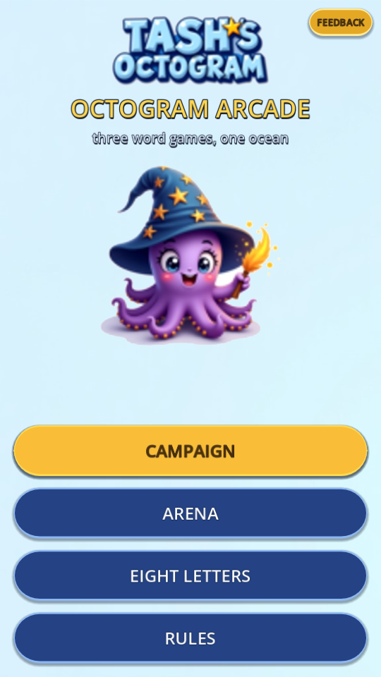
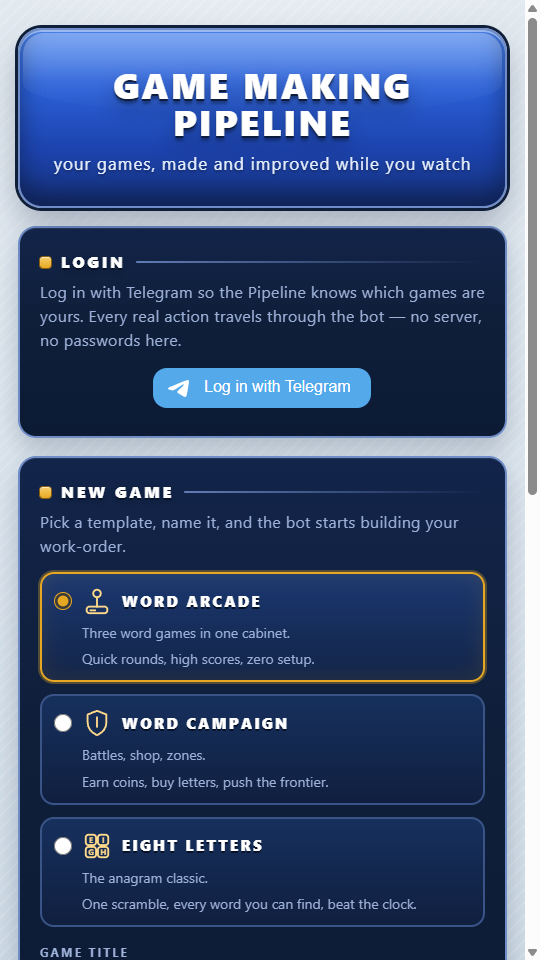
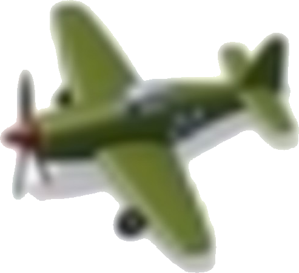

# The Game Making Pipeline — Diary

*The adventure log of a factory that makes games. Updated by machines and humans as things happen.*

Format law: entries are appended, never rewritten. Each entry: `## <date> <time-ish> — <title>`, a short honest paragraph (what happened, what broke, what was learned), optional image. Screenshots live in `images/`. Nothing ships past a red wall — the diary records failures too.

---

## 2026-09-21 afternoon — a gift for Tash

Aaron asked for a word game for Tash. By evening there were three: a Word Poker recreation (her own, branded TASH'S OCTOGRAM), a magical word RPG where words are spells, and Eight Letters — the East of the Web classic reborn. All on the internet, all from one engine family, 846 automated checks green. Tash's game has a QUICK START in its tutorial because she likes to *play*, not read.

## 2026-09-21 night — the dictionaries learn manners

The 148,000-word dictionary kept accepting words like AAHED. We built SCOWL tiers — COMMON (26,955 everyday words) / STANDARD / EXPERT — unioned across five regional variants so THEATERS and THEATRES are both legal, like the original EotW players begged for in 2005. A three-state cycler in every rules panel. COMMON by default, kindness by default.

## 2026-09-21 late — sounds, back buttons, and the great rate-limit lesson

Ten procedural retro SFX per game, SOUND toggles, BACK buttons on every screen that had trapped you. Twice tonight the worker-haiku lane hit its 5-hour usage cap mid-agent — and both times the agent had *finished the work before dying*. Doctrine learned: verify the disk before relaunching anything.

## 2026-09-22 morning — the Pipeline is born

The three games became one (OCTOGRAM ARCADE) and got a front door: a hub with **Login with Telegram**, a NEW GAME picker, MY GAMES. The bot went live both ways — Aaron's phone got the first message. The whole system got its name: **the Game Making Pipeline**. Feedback in, deployed games out, no servers, no budget.

## 2026-09-22 morning — the gate wall moves to the cloud

First CI run: the official godot image doesn't exist. Second run: no fontconfig, and — the real find — the game repo held web files, not source. Restructured (main = source, deploy = export, Pages on deploy). Third run: a *duplicate class file* Rog's stale cache had been hiding; the clean container ratted it out. Fourth run: **7 suites, 671 checks, green on GitHub's own runners.** The cloud doesn't forgive cached lies. That's exactly why it's the judge.

## 2026-09-22 midday — the crew gets a boss and workers

glm-5.3 (slow, thorough) became the BOSS: triage, plan, review — it owns the last word. openrouter/free became the WORKERS: fast drafters. Your directive: *the boss coordinates and reviews; the workers build.* The all-cloud conversion landed the same hour: deploys push only to the deploy branch, runtime state commits back to the repo — git is the database, and the Pipeline now runs with every machine in the house switched off.

## 2026-09-22 afternoon — the factory's missing conveyor belt

A `/newgame` order used to die in a folder. Now: poll spots it → the factory workflow instantiates from template → **the full gate wall** → publishes to the hub at `games/<player>-<slug>/` → Telegram messages the player their live link. Making the game AND testing it, one chain.

## 2026-09-22 evening — two original games at once

**STAR VISITOR** (a systems study of Alien Hominid — original assets only): slice A green, 77+77 checks twice, the 3-bullet cap proven, the one-hit economy working.

**GYRO SQUADRON '45** (Strikers 1945-inspired, steered by phone tilt): the control prototype — the riskiest part — landed as *tested math*: gravity-truth tilt, calibration, dead zone, quadratic curve, clamps. 17+17 twice, plus a 6-second full-tilt sway soak that never left bounds.

Both are being built milestone by milestone, each landing with its own battery, nothing "done" until green twice in a row.

## Project diaries

Every project keeps its own phase-by-phase diary in its repo (entries append at every green wall):

- [Octogram Arcade](https://github.com/slothitude/octogram-arcade/blob/main/DIARY.md)
- [STAR VISITOR](https://github.com/slothitude/star-visitor/blob/main/DIARY.md)
- [GYRO SQUADRON '45](https://github.com/slothitude/gyro-squadron-45/blob/main/DIARY.md)
- [SONAR](https://github.com/slothitude/sonar/blob/main/DIARY.md) *(TFS jam)*
- [SLIME LINE](https://github.com/slothitude/slime-line/blob/main/DIARY.md) *(Humboldt jam)*

---

## 2026-09-22 10:40 — The diary begins

The Pipeline started keeping this journal — entries append as games are born, deployed, and improved. Failures get recorded too.

---

## 2026-09-22 12:48 — Gyro Squadron: Act 1 flies

Milestone 2 landed green on the double — four weapon tiers, the charge Super, bombs, two enemy brains, the fortress boss in two phases, a 55-second stage with escalating waves and a clear tally. The tilt core from M1 carried it all; every number lives in feel.gd.

---

## 2026-09-22 12:48 — SONAR is born (jam entry)

TFS Jam, theme 'It Came From Below': a submarine in black water that sees only by pinging. Six original sprites generated, the vision-core agent is building the ping-reveal mechanic. Deadline: Sept 24, 6PM EST.

---

## 2026-09-22 13:13 — SONAR: the ping sees

Milestone 1 green on the double — the vision core works: cooldown-gated pings, a ring sweeping outward revealing wrecks as echoes that fade over 3.7 seconds, everything else darkness. The battery even caught the agent's own blind spot (a method that didn't exist) and closed it. M2 — the creatures from below — is building.

---

## 2026-09-22 13:16 — Star Visitor: the alien rides

Slice B green on the double — the signature systems live: mount an agent and flail it around, bite to scare its friends, flip-and-throw it as a weapon; burrow under the field, drag enemies down, mind the four-second suffocation clock; style points for flair, every 5000 buys a life. Its own battery caught two bugs mid-build. Slice C (the mini-boss) queues behind the christening.

---

## 2026-09-22 13:32 — Every game gets its lore

Each project now keeps its own diary (per-phase, gate-linked), its own LORE.md written in-world, and devlog sketches in the Oddworld tradition — instructions as artifacts: a diver's logbook page, a slug almanac, a redacted incident report, a pilot's letter, a storybook page of the Word Ocean. Sketches generate per milestone via journal/sketch.py.

*Next entries write themselves: slice B (riding and burrowing), Act 1's fortress boss, the first player-made game from the hub, the christening — the first feedback-to-deploy lap with a human watching a phone.*
