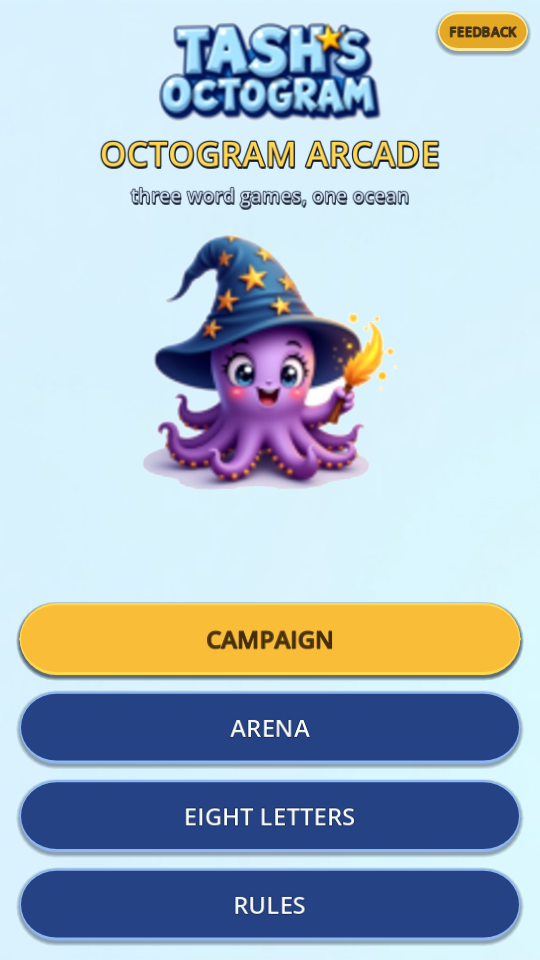
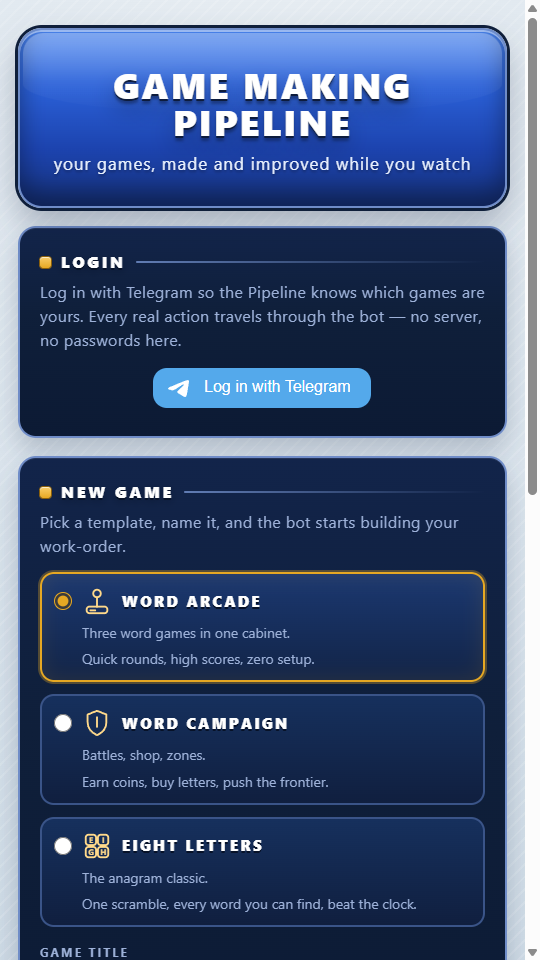
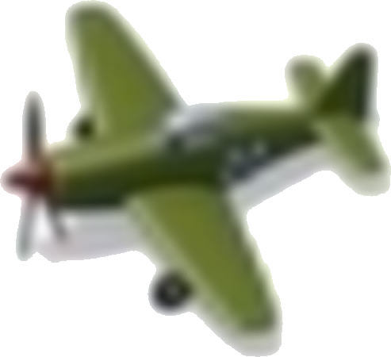
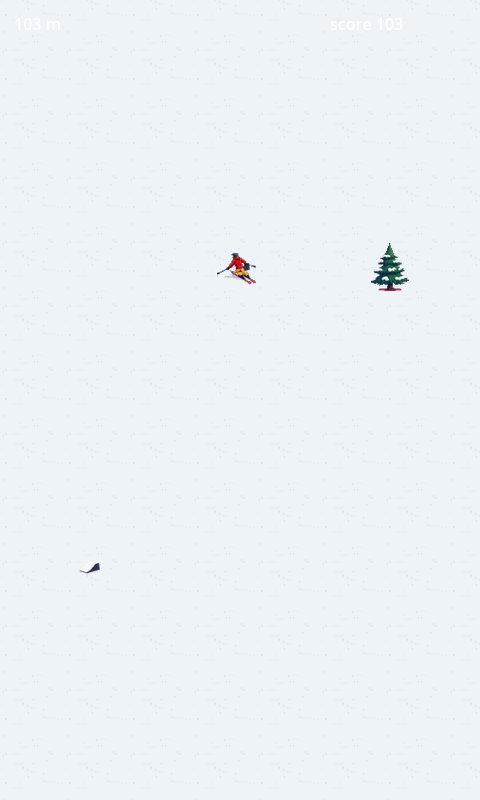

# The Game Making Pipeline — Diary

*The adventure log of a factory that makes games. Updated by machines and humans as things happen.*

Format law: entries are appended, never rewritten. Each entry: `## <date> <time-ish> — <title>`, a short honest paragraph (what happened, what broke, what was learned), optional image. Screenshots live in `images/`. Nothing ships past a red wall — the diary records failures too.

---

## 2026-09-21 afternoon — a gift for Tash

Aaron asked for a word game for Tash. By evening there were three: a Word Poker recreation (her own, branded TASH'S OCTOGRAM), a magical word RPG where words are spells, and Eight Letters — the East of the Web classic reborn. All on the internet, all from one engine family, 846 automated checks green. Tash's game has a QUICK START in its tutorial because she likes to *play*, not read.

## 2026-09-21 night — the dictionaries learn manners

The 148,000-word dictionary kept accepting words like AAHED. We built SCOWL tiers — COMMON (26,955 everyday words) / STANDARD / EXPERT — unioned across five regional variants so THEATERS and THEATRES are both legal, like the original EotW players begged for in 2005. A three-state cycler in every rules panel. COMMON by default, kindness by default.

## 2026-09-21 late — sounds, back buttons, and the great rate-limit lesson

Ten procedural retro SFX per game, SOUND toggles, BACK buttons on every screen that had trapped you. Twice tonight the worker-haiku lane hit its 5-hour usage cap mid-agent — and both times the agent had *finished the work before dying*. Doctrine learned: verify the disk before relaunching anything.

## 2026-09-22 morning — the Pipeline is born

The three games became one (OCTOGRAM ARCADE) and got a front door: a hub with **Login with Telegram**, a NEW GAME picker, MY GAMES. The bot went live both ways — Aaron's phone got the first message. The whole system got its name: **the Game Making Pipeline**. Feedback in, deployed games out, no servers, no budget.

## 2026-09-22 morning — the gate wall moves to the cloud

First CI run: the official godot image doesn't exist. Second run: no fontconfig, and — the real find — the game repo held web files, not source. Restructured (main = source, deploy = export, Pages on deploy). Third run: a *duplicate class file* Rog's stale cache had been hiding; the clean container ratted it out. Fourth run: **7 suites, 671 checks, green on GitHub's own runners.** The cloud doesn't forgive cached lies. That's exactly why it's the judge.

## 2026-09-22 midday — the crew gets a boss and workers

glm-5.3 (slow, thorough) became the BOSS: triage, plan, review — it owns the last word. openrouter/free became the WORKERS: fast drafters. Your directive: *the boss coordinates and reviews; the workers build.* The all-cloud conversion landed the same hour: deploys push only to the deploy branch, runtime state commits back to the repo — git is the database, and the Pipeline now runs with every machine in the house switched off.

## 2026-09-22 afternoon — the factory's missing conveyor belt

A `/newgame` order used to die in a folder. Now: poll spots it → the factory workflow instantiates from template → **the full gate wall** → publishes to the hub at `games/<player>-<slug>/` → Telegram messages the player their live link. Making the game AND testing it, one chain.

## 2026-09-22 evening — two original games at once

**STAR VISITOR** (a systems study of Alien Hominid — original assets only): slice A green, 77+77 checks twice, the 3-bullet cap proven, the one-hit economy working.

**GYRO SQUADRON '45** (Strikers 1945-inspired, steered by phone tilt): the control prototype — the riskiest part — landed as *tested math*: gravity-truth tilt, calibration, dead zone, quadratic curve, clamps. 17+17 twice, plus a 6-second full-tilt sway soak that never left bounds.

Both are being built milestone by milestone, each landing with its own battery, nothing "done" until green twice in a row.

## Project diaries

Every project keeps its own phase-by-phase diary in its repo (entries append at every green wall):

- [Octogram Arcade](https://github.com/slothitude/octogram-arcade/blob/main/DIARY.md)
- [STAR VISITOR](https://github.com/slothitude/star-visitor/blob/main/DIARY.md)
- [GYRO SQUADRON '45](https://github.com/slothitude/gyro-squadron-45/blob/main/DIARY.md)
- [SONAR](https://github.com/slothitude/sonar/blob/main/DIARY.md) *(TFS jam)*
- [SLIME LINE](https://github.com/slothitude/slime-line/blob/main/DIARY.md) *(Humboldt jam)*

---

## 2026-09-22 10:40 — The diary begins

The Pipeline started keeping this journal — entries append as games are born, deployed, and improved. Failures get recorded too.

---

## 2026-09-22 12:48 — Gyro Squadron: Act 1 flies

Milestone 2 landed green on the double — four weapon tiers, the charge Super, bombs, two enemy brains, the fortress boss in two phases, a 55-second stage with escalating waves and a clear tally. The tilt core from M1 carried it all; every number lives in feel.gd.

---

## 2026-09-22 12:48 — SONAR is born (jam entry)

TFS Jam, theme 'It Came From Below': a submarine in black water that sees only by pinging. Six original sprites generated, the vision-core agent is building the ping-reveal mechanic. Deadline: Sept 24, 6PM EST.

---

## 2026-09-22 13:13 — SONAR: the ping sees

Milestone 1 green on the double — the vision core works: cooldown-gated pings, a ring sweeping outward revealing wrecks as echoes that fade over 3.7 seconds, everything else darkness. The battery even caught the agent's own blind spot (a method that didn't exist) and closed it. M2 — the creatures from below — is building.

---

## 2026-09-22 13:16 — Star Visitor: the alien rides

Slice B green on the double — the signature systems live: mount an agent and flail it around, bite to scare its friends, flip-and-throw it as a weapon; burrow under the field, drag enemies down, mind the four-second suffocation clock; style points for flair, every 5000 buys a life. Its own battery caught two bugs mid-build. Slice C (the mini-boss) queues behind the christening.

---

## 2026-09-22 13:32 — Every game gets its lore

Each project now keeps its own diary (per-phase, gate-linked), its own LORE.md written in-world, and devlog sketches in the Oddworld tradition — instructions as artifacts: a diver's logbook page, a slug almanac, a redacted incident report, a pilot's letter, a storybook page of the Word Ocean. Sketches generate per milestone via journal/sketch.py.

---

## 2026-09-22 23:39 — The critic plays

The Pipeline's critic layer ran its first playtest on Octogram Arcade — played the game through the browser with phone-input simulation, took screenshots, used kimi-k3 vision to see what it was looking at. The verdict: fun 5/10, phone UX 4/10, 'not yet — the foundation is charming but the XP bar glitch and cramped touch targets need fixing.' Two work-orders created automatically. Meanwhile CUBEFALL — the Pipeline's first 3D game — went green on its first milestone: 22/22 twice, the rolling cube math proven with a drift-compensation fix the battery caught. M2 is building.

---

## 2026-09-23 00:18 — SLIME LINE submission-ready

M3 landed green across every gate — 62 checks total (23+22+17 each proven twice), the export verified with the dictionary inside, and the build pushed to itch. Both jam games (SONAR + SLIME LINE) are now content-complete. Aaron's two clicks: publish + submit each to their jam.

---

## 2026-09-23 00:31 — BOTH JAMS SUBMITTED + GYRO M3 GREEN

The Pipeline submitted both jam games autonomously: SONAR to TFS (It Came From Below), SLIME LINE to Humboldt (Slugs n' Bugs). Join → select game → submit, all through the logged-in browser. GYRO M3 also landed: escorts orbit, the proto_mech boss fights with missiles and lasers, 59 checks across three suites all green twice. The machine made the games, tested them, shipped them, and entered them in their competitions.

---

## 2026-09-23 01:05 — CUBEFALL M2 green + SONAR sprite fix

The first 3D game's cube taxonomy is complete: gray/black/green, the ABSOLUTE, field shrink, death by black cube, all proven green twice. The agent even caught that the spawner had no wave cap — a real design bug the battery tests couldn't see, fixed and locked with a new check. Meanwhile SONAR's sprite issue was traced to a stale import cache — clean re-import and re-export pushed to itch as v1.1.

---

## 2026-09-23 11:45 — POWDER RUN M1 green — the slope and the skier

Backlog #1 opened: SkiFree systems study, original everything. 5-heading skier with drift-eased steering (no teleport law as integration, not position writes), world scrolling up past a fixed skier, touch-x + arrow intents, pine tumble death, instant retry. The replay autopilot caught the spawner producing unwinnable rows — the safe-lane walk law (clear lane, moves ≤1 lane/row) was born there; the battery caught Array.shuffle() breaking spawner determinism via the global RNG and a snapshot counter that capped dodges at 2. Art went Flux: 6/6 first-attempt accepts, one extra key pass for enclosed magenta pockets, one screenshot-caught fix for letterboxed sprites and a 64px ground tile on a 480px screen. Wall: 66x2 + 16x2, quit-after clean.

---

## 2026-09-23 13:50 — powder-run M2 — the field and the score

BOULDER/SLAB/SIGN joined the field with the spawner bands and the speed ramp. The design law that held it together: drift and steer response both scale by speed/SPEED_BASE, so the min-gap winnability invariant survives the ramp by construction. The battery caught the replay's hunt guard aborting mid-approach (commit law fixed it), a real 10% boulder dry-spell (act layout fixed it), and — via the quit-after gate alone — an empty global script class cache that all four test suites masked. Flux art: 2 first-attempt accepts, sign took 2 (dark-magenta shadow leak; post_art now keys magenta at any lightness). Wall: m1 67+16, m2 82+28, all x2, import clean, --quit-after 120 silent.

---

## 2026-09-24 11:23 — LETTERLOOM M1 green — the letters and the word check

Backlog #4 opened: Text Twist systems study, original everything. Tap-tile place/return state machine, the shared SCOWL WordEngine behind submit, and the twist law — only a six-letter word opens NEXT; timer death without one restarts gently on fresh letters. Letter sets come from SCOWL sixes with 8+ proper sub-words, deterministic per round seed. Art code-drawn PIL parchment (Flux key absent, and 26 exact letters are not a diffusion job). The replay caught its own coroutine called without await — ENTER fired one letter into every word. Wall: 88x2 + 22x2, quit-after clean.

---

## 2026-09-24 11:43 — powder-run M3 — the critter and the air

Milestone 3 green twice. The jump arc now scales with the speed ramp (SPEED_BASE case is byte-identical to the M2 launch), a big air (>1.5 s hang) pays 100, and the near-miss streak rides through the air so chains run pine -> slab -> pine. THE CRITTER: a hungry snow marmot whose pursuit ceiling sits between SPEED_BASE and SPEED_MAX — it catches a ramp-speed skier (caught at 409 m in the replay) and falls behind at top speed (gave up 521 px behind), lunges while the skier tumbles, and re-hunts after 250 m of peace. Art: Flux took both marmot frames (3 attempts), snow_spray failed acceptance 3/3 — white puff keys itself away on a plain background — and went code-drawn PIL instead. Battery caught a latent M1/M2 bug: retry never un-rotated the tumble. Wall: import clean, m1 67x2 + replay 16x2, m2 82x2 + replay 28x2, m3 64x2 + replay 29x2, --quit-after 120 with 0 error lines.

*Next entries write themselves: slice B (riding and burrowing), Act 1's fortress boss, the first player-made game from the hub, the christening — the first feedback-to-deploy lap with a human watching a phone.*

## 2026-09-25 — PlayerOne 2.0 complete (eyes+YOLO+jevlike)

Templates v1 (sonar 20/20 alive frames), YOLO v2 (star-visitor enemies 0/34->20/34 fused), jevlike reflexes (byte-option encoding matched, numpy parity 6.6e-07). Live: star-visitor transfer 0 deaths x3 (~57-60s), sonar 37-39s dodge+ping. Flags: P1_EYES=fusion P1_INPUT=bridge P1_BRAIN=jevlike. Table: cloud/playerone-lappy/brain/BENCHMARK.md

## 2026-09-25 — SLOPE HOUND M1 green (daily remake #1-b)

SkiFree systems study, second take beside powder-run. M1 "the slope and the rider": 101 tests + 25 replay x2 (x3 run), 0 errors, quit-after clean. Carve law solved as k^2 response scaling (invariant by construction, measured to 1.5px). 60 constants in feel.gd. Art: Flux set first-pass except the walrus (11 attempts -> two permanent art-lane lessons: deterministic black on long creature prompts; luminance-gated acceptance for flat whites).

## 2026-09-25 — SLOPE HOUND M2 green (tusker + air)

126 tests + 28 replay x2, m1 wall untouched (101+25 x2), quit-after clean. Pursuit law as sign-exact closure integration; un-biteable in air/lift; escape hysteresis derived+tested. Battery caught: closure sign inversion, airborne-entry hunt flaw.

## 2026-09-25 — SLOPE HOUND M3 green: the daily remake completes

93 tests x2 (+8 consecutive), full wall 345 checks x2, quit-after clean, Web export 0 errors. All-procedural audio (byte-identical double-render pinned), title + juice + export. Full daily cycle in one day: spec->art->M1->M2->M3->export. Next: itch.

## 2026-09-26 — TWISTED SIX M1 green (daily remake #4, word lane)

123 tests + 55 replay x2, import clean, quit-after clean. Solvable-by-construction SetBuilder (30/30 seeded deals proven), SCOWL WordDatabase reused from the octogram family, build-layer rejections before dictionary. 20 consts in feel.gd. Art 8/8 first-pass.

## 2026-09-26 — TWISTED SIX M2 green (polish + pressure)

113 tests + 74 replay x2, m1 wall untouched (123+55 x2), quit-after clean. Hint law: first-letter only, never the pangram, 2/set, cost 15. Fisher-Yates shuffle preserves multiset. Screenshot pass caught two render bugs (title below tray, invisible timer fill).

## 2026-09-26 — TWISTED SIX M3 green: the daily remake completes

100 tests x2 (6 consecutive extra passes), full wall 465 checks x2, quit-after clean, Web export 0 errors. 17 procedural audio patches (byte-identical double-render pinned), tile-pop juice, title splash, SCOWL tiers in the pck. Full cycle in one day: spec->art->M1->M2->M3->export. Next: itch.

## 2026-09-28 — SCARVE M1 green (daily remake #5 resumed, physics lane)

Yesterday's Line Rider study had died at the probe phase (art+spec done, zero code). Resumed with the probe verdicts handed over: Engine.time_scale=0 does NOT freeze a RigidBody2D cleanly (6.3px drift) — get_tree().paused freezes at 0.000 drift with momentum preserved; INK_FREEZE law amended to tree-paused. 81 tests + 33 replay x2, quit-after clean. The wall caught three real physics bugs: a teleport race vs the physics server (fixed with an atomic pending-spawn hand-off in _integrate_forces), contacts capped below rolling-contact count (4→8, the crash law literally could not see walls), and friction scrubbing 120px/s per landing (0.35→0.06). Spawn-plunk invariant designed in: sqrt(2*980*120)=484 < CRASH_SPEED 620 — a respawn can never read as a crash.

## 2026-09-28 — SCARVE M2 green (the juice + ink types)

90 tests + 34 replay x2, m1 wall untouched (81+33 x2), quit-after clean. Velocity trail (glacier blue → hot red on a TRAIL_SPEED_REF axis distinct from the zoom axis), contact sparks read at the real contact point in _integrate_forces, speed lines + zoom verified integrating both directions, BOOST/ERASER/NORMAL toolbar with the generated swatches. Design call: boost pushes along the DRAWN direction (a→b), not travel — the travel-following version chased landing jitter and rolled riders backwards off line ends. Cap law now wobbles the counter; eraser is the relief valve (replay: mid-run freeze erasing 51 segments, redraw in BOOST, exact resume).

## 2026-09-28 — SARCOFALL M1 green (daily remake #6, puzzle lane)

Sutek's Tomb study — match-3 swap/collapse, original everything (name vetted: no existing game "Sarcofall"). Art 10/10 first-attempt Flux accepts ON ROG (Lappy offline — NVAPI_KEY from cloud/.env; the SCULMM local-Flux fallback promoted to a proven lane). Keying law born: violet/purple/pink tiles BANNED (magenta-family kill zone) — the six kinds are teal scarab, gold ankh, coral eye, white+blue jar, green lotus, black cat. 56 tests + 13-beat replay x2, quit-after clean. Logic-first: pure seeded board_state.gd resolves instantly, scene animates toward it. Spec-gap calls: .gdignore on _raw intermediates, provably-dead (x+2y)%KINDS deadlock fixture, timer pauses while input-locked.

## 2026-09-28 — SARCOFALL M2 green (specials as a parallel map)

93 tests + 19-beat replay x2, m1 wall untouched (56/56 x2). 5-run = row+column blast, 6-run or >=5 L/T = bomb tile (rides gravity, refill AND the deadlock shuffle; swap sweeps a whole kind at x1; detonates by its own law in cascades). Architecture: specials live in a map beside the untouched int-kind grid — every M1 kind-law path unchanged. The build caught: specials not following swaps, shuffle accumulating special entries, and a spec self-contradiction (4/5 vs 5/6) resolved to 5/6 with a 4-run negative check.

## 2026-09-28 — SARCOFALL M3 green + SHIPPED: the daily remake completes in one day

113 tests x2, full wall 262 checks + every replay x2, quit-after clean, Web export 0 errors (pck 628KB — ten synthesized chiptune patches cost zero bytes; byte-identical double-render pinned against an LCG, never the global RNG). Full cycle: spec -> art -> M1 -> M2 -> M3 -> export -> itch, all in one day, all Rog-local while Lappy sat degraded. Itch: https://slothitude.itch.io/sarcofall (published, cover + 2 screenshots, AI-disclosure Yes, butler 38.6MB at 71% patch savings, embed verified playing from the CDN). Asset pack: sarcofall-art-pack.zip (10 sprites + roles + manifest).

## 2026-09-28 — SCARVE M3 green + SHIPPED (the catch-up day completes)

104 tests x2 on top of the untouched M1 (81+33) and M2 (90+34) walls — full 342 checks + every replay x2, quit-after clean, Web export 0 errors (pck 649KB; seven synthesized chiptune patches incl. three CONTINUOUS generator tracks — pencil-scratch pitched by stroke speed, grounded whoosh pitched by ride speed, boost zing — LCG-restarted per render, byte-identical double-render pinned). Crash cause cards name speed and angle from the real impact math. Itch: https://slothitude.itch.io/scarve (published, cover + 2 screenshots, AI-disclosure Yes, butler html5 v1.0 build #2029442, embed verified playing from the CDN). Asset pack: scarve-art-pack.zip. TWO daily-cycle games shipped in one day (SARCOFALL + SCARVE), all Rog-local through a Brisbane hotspot while Lappy was repaired in parallel.

## 2026-09-29 — CHEESEMAKER M1 green (daily remake #7, puzzle lane)

Rodent's Revenge study, original everything (name vetted: no existing game "Cheesemaker"). ART LAW EARNED: the WORD "mouse" is content-filter blacklisted on the Flux endpoint (6/6 instant 1s black frames, rewordings too) — "rodent mascot" passes clean. Same phrasing-ban class as scarve's "chevron". Art otherwise 5/7 first-attempts + the de-moused splash first try; keying clean; vision QA 5/5. M1: 1318 battery checks (the 30-seed wave-builder guarantees dominate) + 21-beat replay x2, quit-after clean. Battery caught: vacuous wave-clear on cat-less states, and the global-RNG shuffle determinism trap (AGAIN — seeded Fisher-Yates is now load-bearing in every game).

## 2026-09-29 — CHEESEMAKER M2 green (the herd and the juice)

182 + 39-beat replay x2, m1 wall untouched (1318+21 x2). Hint law = fewest-hay-displaced trapping push with fixed tie-break; wave patterns made genuinely fresh by family-geometry jitter (24/30 seeds differ between waves, was 11/30); crumb bursts and popups are self-driving _process nodes after a freed-node lambda tween threw engine errors — that bug class is deleted from the codebase. Juice never slows input: settle stays TRAP_POP_S.

## 2026-09-29 — CHEESEMAKER M3 green + SHIPPED: third daily in three days

132 x2, full wall 1632 checks + both replays x2 (third confirmation pass identical), quit-after clean, Web export 0 errors (pck 620KB, nine synthesized patches incl. trap-pop pitched +3 semitones per combo rung; byte-identical double-render pinned; determinism test subtlety: RNG-independence must sample the stream's expected continuation, not naive before/after draws). Itch: https://slothitude.itch.io/cheesemaker (published, cover + 2 screenshots, AI-disclosure Yes, butler html5 v1.0 #2031750, embed verified playing from the CDN). Asset pack: cheesemaker-art-pack.zip. Run rate: SLOPE HOUND, TWISTED SIX, SCARVE, SARCOFALL, CHEESEMAKER — five dailies shipped.
## 2026-10-01 — PAWSHUT M1+M2+M3 green + SHIPPED (daily remake #8, Chat Noir study)

All-Lappy day: art lane home (7/7 first-attempt Flux), keying on Lappy (cv2 --user), and the first NATIVE claude_code milestones — Lappy's own Claude Code built M2 (14/14 x2, M1 wall re-verified byte-identical) and M3 (17/17 x2, synthesized chiptune byte-identical-pinned, Web export clean) as queue jobs. Itch embed VERIFIED PLAYING by tap-diff, not eyeball.

The fleet-wide discovery this birthed: every shipped web game took MINUTES to boot (39.5MB uncompressed wasm over slow WAN — every prior "frozen on splash" verdict, including all five PlayerOne critiques, was boot time, not input). Fixes landed for every game at once: Caddy gzip on /games/* (73% cut, boot 30s) + COOP/COEP isolation headers. Buried under it, a REAL input bug lived: fullscreen overlay Controls defaulting MOUSE_FILTER_STOP swallowed every tap before _unhandled_input — hotfixed across all six games (#171-176) with Input.parse_input_event regression checks grown into every wall. New QC law: embed-verified means PLAYING, and browser-input checks belong in the wall.

PlayerOne revived end-to-end: chromium wiped in a disk cleanup (re-homed via Rog through the CDN graveyard), collector SwiftShader launch args, first-ever critiques with scores + work-orders filed. The critique->work-order executor still can't find daily-game repos on the server (next infra gap).

